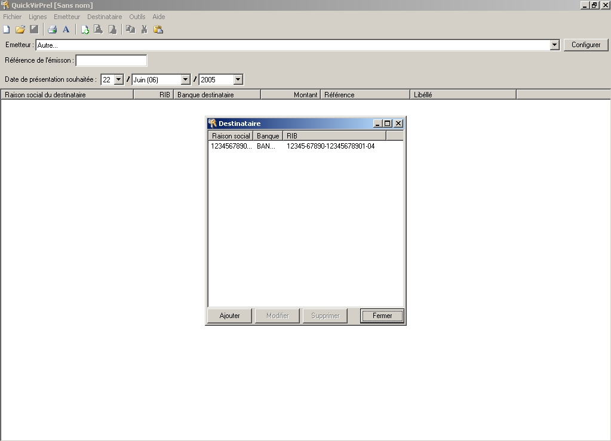
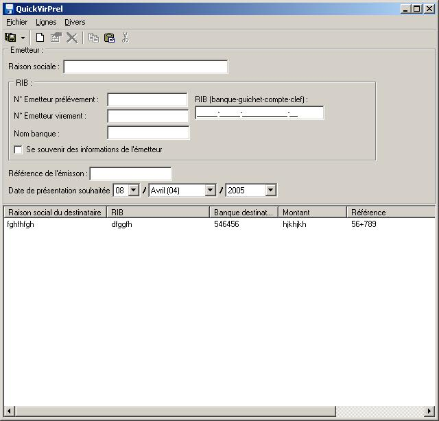
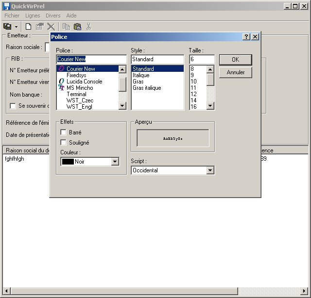
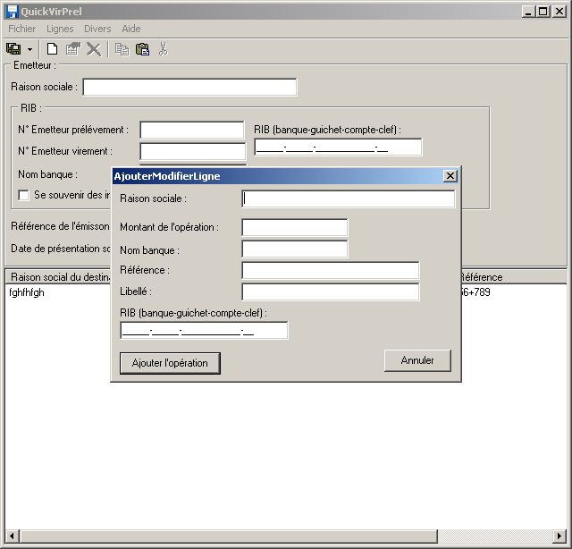

# quick-vir-prel

A software to generate AFB-CFONB file (standard before SEPA)

**QuickVirPrel** est un logiciel **gratuit** pour créer facilement des fichiers de virements ou prélévements bancaire. Ces fichiers sont au format **AFB-CFONB**, normes définit par l'<a href="http://www.afb fr">Association Française des Banques</a> et le Comité Français d'Organisation et de Normalisation Bancaire.

Ces fichiers sont donc acceptés par toutes les banques de France et peuvent être manipulés par tous les logiciels comptables.

**QuickVirPrel** est une application qui fonctionne sous **Windows 95, 98, Millenium édition(Me), NT 4, 2000, XP, 2003**.

## 2 - Caractérisitques

* Supporte des versions 95 OSR-2, 98, Millennium édition, NT 4, 2000, XP et 2003 de Windows
* Support des th&egrave;mes de Windows XP
* Place disque nécéssaire 900 Ko
* Mémoire vive nécéssaire  32 Mo minimum
* Logiciel **gratuit** pour une utilisation commerciale ou non

